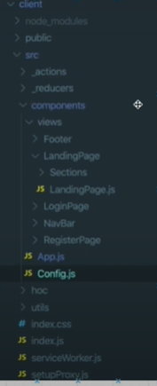

# React 

> Boiler Plate 에 특성화된 구조 설명
>
> 기본적인 CRUD 와 User 관련 method 들을 정의할 예정

- App.j s 
  - Routing 관련 일을 처리한다
- Config.js 
  - 환경 변수 같은 것들을 정하는 곳 
- hoc ( Higher Order Component )
  - function 
  - 다른 컴포넌트를 갖는 function
  - 예를 들어, 해당 유저가 해당 페이지에 들어갈 자격이 되는지를 알아 낸 후에 자격이 된다면 다음 액션을 취할 수 있도록 하게 해준다.
- utils 
  - 여러 군데에서 쓰일 수 있는 것들을 이곳에 넣어둬서 어디서든 쓸 수 있게 해줌

