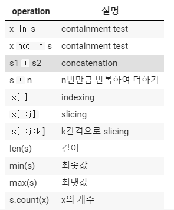
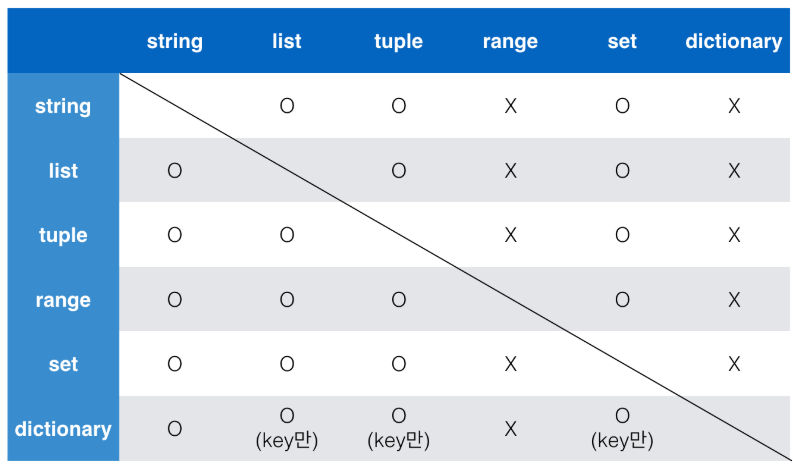

# Container 

여러 개의 값을 저장할 수 있는 것.

-순서 -> 순회가 가능

​	- []

-순서x

	- {} 

일단 list만 본다

list를 잘 다루는게 중요하다.

### 1) 시퀀스형 컨테이너

데이터가 순서대로 나열된 형식을 나타냄

- 주의! 순서대로 나열된 것을 **정렬 되었다고 생각하면 안됨.**
- 특정 위치의 데이터를 가리킬 수 있다.

- 리스트, 튜플, 레인지, 문자형, 바이너리 ---


#### list

[] 로 만들어짐 

x=[1,2]

#### tuple 

x=(1,2) 

튜플은 리스트와 유사하지만, `()`로 묶어서 표현합니다.

**그리고 tuple은 수정 불가능(불변, immutable)하고, 읽을 수 밖에 없습니다.**

직접 사용하기 보다는 파이썬 내부에서 다양한 용도로 활용되고 있습니다.

#### range 

숫자의 시퀀스를 나타내기 위해 사용

range(n,m,s)

n부터 m-1까지 +s만큼 증가한다.

```
a=list(range(0,-9,-1))
a
```

##### 시퀀스에서 활용할 수 있는 연산자/ 함수



```
numbers = [1,2,3,4,5,6,7]
print(numbers[0:5:2])

print(numbers[-1]) 
print(numbers[-5:-1:2])

x=[1,2,3,4,2,4,3,4,1]
x.count(1) # 해당 요소의 개수를 카운트

```


### 2) 비 시퀀스형 컨테이너

- 셋(set)

  - 순서가 없는 자료 구조

  - 집합과 동일하게 처리된다.

  - {} 중괄호를 통해 만들며, **순서가 없고 중복된 값이 없다.**

  - 빈 집합을 만들려면 set()을 사용해야 한다. 

    ```
    a={1,1,2,2,3,3}
    print(a)
    => {1,2,3}
    ```

  - set 연산자 가능 |(합집합), &(교집합) , - (차집합)

- dictionary 

  - {}를 통해 만들며, dict()로 만들수도 있다.

  - key는 변경 불가능한 데이터만 가능.()

  - value는 list, dictionary를 포함한 모든 것이 가능.

  - ```
    dic = {
        True :{0,1 },
        (0,1) :'이건 튜플이다.',
         range(2):'이건 레인지'}
    print(dic[True])
    ```

    

### 컨테이녀형 형변환



### * 데이터의 분류

- 변경 불가능한 데이터
- 변경 가능한 데이터


# 제어문


