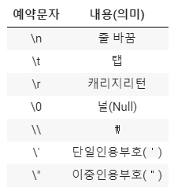
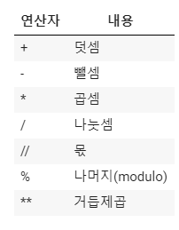
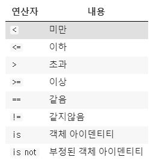
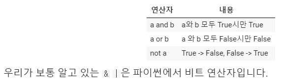
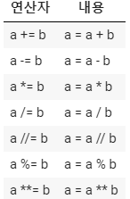

# 7/20 python 첫수업

### - web application 배울 것임 

: python, html/css, django, database, javascript ---

프로그래밍 언어 - python

1. 저장 (변수/ 저장 )- 무엇을 어떻게 어디에
2. 제어 (조건 / 반복) 

codlab 을 이용해서 진행

**python doc - 파이썬 공식문서를 보는 것을 추천한다.**


# 1. 변수

dust = 60 (60이라는 숫자를 dust 안에 넣는다.)


### 1) 할당연산자

- 변수는 = 을 통해 할당된다.
- 해당 데이터 타입을 확인하기 위해서는 type()을 활용함.
- 해당 값의 메모리 주소를 확인하기 위해서는 id()를 활용함

**다른 값을 동시에 할당.**

```
a,b=2020,4

print(a)

print(b)
```

```
a, b =b,a    #값을 바꿀 수 있다.

print(a)

print(b)
```

### 2) 식별자

파이썬에서 식별자는 변수 함수 모듈 클래스 등을 식별하는데 사용되는 이름입니다.

- 아래의 예약어는 사용 못함.

\# 예약어들을 직접 확인해봅시다.

```
import keyword #외부에 있는 것 을 가져와서 쓸게.

print(keyword.kwlist) #예약어들 직접 확인.
```


# 2. 데이터 타입

### 1) 숫자타입

- int - 어떤 숫자든 호용이 가능하다. max * max 도 가능

- ```
  binary_number = 0b10 #2진수값으로 입력했지만 10진수 값으로 나옴 
  
  print(binary_number)
  
  octal_number =0o10 #8진수 
  
  print(octal_number)
  
  hexadecimal_number = 0x10 #16진수
  
  print(hexadecimal_number) 
  ```

  ```
  **실수의 연산 (중요하다..실수를 많이 할 수 있기 때문)**
  
  3.0 - 실수 연산
  
  round(3.5 - 3.2,2) # 소숫점 둘째자리에서 반올림.
  
  == 0.3 - true 나옴
  
  a = 3.5 -3.2
  
  b= 0.3
  a == b  false #주의 해야함.
  ```

  ```
  a= 3.5-3.12
  b=3.8
  
  abs(a-b)<= 1e-10 #작을때 같다라고 생각하고 true
   
  
  import sys
  
  print(sys.float_info.epsilon) #굉장히 작은 값.
  abs(a-b) <= sys.float_info.epsilon  ->true
  
  
  import math
  
  math.isclose(a,b) #값이 서로 가까이 있으면 TRUE
  ```

  ### 2) 문자타입

  ```
  number=input('숫자를 입력해주세요.') #문자로 인식
  
  print(int(number)* 2) #정수로 바꿔줌 
  ```

  ### 3) 이스케이프 시퀀스 

  

  

  ```
  > print('hello',end='\t') #\n 값은 기본으로 들어가있기때문에 end를 이용해서 조작해준다.
  
  > print('ssafy')
  ```

  

  ### 4 )string interpolation 중요하다

  - `%-formatting`
  - [`str.format()`](https://pyformat.info/)
  - **[`f-strings`](https://www.python.org/dev/peps/pep-0498/) : 파이썬 3.6 이후 버전에서 지원 !!!!!!!!**

  print('내 이름은 %s 입니다.' % name) #옛날 방법 

  print('내 이름은 {} 입니다.' .format(name))

  **print(f'내 이름은 {name} 입니다.') #이제 이것을 쓸 것임.  **

  - f string은 형식을 지정가능

    -f'올해는 {n:%Y}년 이번달은 {n:%m}월 오늘은{n:%d}일'

    ```
    import datetime
    
    n = datetime.datetime.now()
    print(n)
    
    
    
    pi=3.141592
    print(f'{pi:.3}') => 3.14 나옴
    
    r=10
    print(f'{pi:.3} 넓이는 : {pi*r*r :.3}')
    ```

    

  ### 5 ) 참/거짓 타입

  - 0 이거나 없거나 0,0.0,(),{},[],' ',none -> **false** 값을 가진다.

  ```
  bool(0)
  bool([])
  => False 값이 나옴
  ```

  - None 타입

    -파이썬에서는 값이 없음을 표현하기 위해 none 타입이 존재.

# 3. 형변환 

데이터타입은 서로 변환할 수 있습니다.

### 1) 암시적 형변환 (중요하다)

-python이 해주는 형변환 스스로

-편리함을 위해 만들었지만 실수를 할 수 있는 부분이다.

**-#연산자가 있을때 type을 맞춰주는게 편하다.**

```
# boolean 
True -> 1
False -> 0

#None 값과는 더하기 빼기 안됨.

```

-숫자간의 형변환

complex > float > int (complex + float -> complex로 바뀜 )

 

### 2)명시적 형변환

-코드로 직접적으로 하는 경우

-글자를 숫자로 숫자를 글자로 

-되도록이면 type들을 일치시켜서 진행하는게 좋다.

**#string 3.5를 바로 int로 변환 가능 안됨. int('3.5')안됨**

**int(float('3.5')) 가능**


but int(3.5)-> 3으로 나옴 왜냐하면 숫자이기때문


# 4. 연산자

### 1)산술 연산자




```
#2의 1000 승 
=> 2 ** 1000 

#몫, 나머지를 나타내주는 함수 divmod
a,b =divmod(5,2)
몫은 a, 나머지 b 나옴

#양수,음수도 표현 가능
```


### 2)비교 연산자




```
정수와 float 비교는 
3 == 3.0 true 
입실론?은 float끼리 비교에서 씀.
```


### 3)논리 연산자(시험문제로 많이 나옴.)



- 단축평가
  - and 일 때  첫째 값이 False 일 때 뒤에 값은 조회 안함. 바로 false 이기때문. 
  - or 일 때는 첫째 값이 False가 나와도 뒤에 봐야함 하지만 True 일때는 반드시 true
  - 즉, 첫 번째 값이 확실할 때, 두 번째 값은 확인 하지 않음

- `and` 는 둘 다 True일 경우만 True이기 때문에 첫번째 값이 True라도 두번째 값을 확인해야 하기 때문에 'b'가 반환된다.
- `or` 는 하나만 True라도 True이기 때문에 True를 만나면 해당 값을 바로 반환한다.

**이러한 단축평가를 통해서 코드를 단축시킬 수 있다. **

5와 0 해보기 


### 4) 복합 연산자




### 5)기타 연산자

- concatenation

  - 'hello' + ' ' + 'ssafy'

  - [1,2,3] + [4,5,6] => [1,2,3,4,5,6]

- containment test

  - 'a' in 'hello'  => False
  - range(45)  45미만을 말하는 것임 이하 아님

- identity 

  - is 연산자를 통해 동일한 것인지 확인하는 것
  - id 가 같은지 확인한다. 

- indexing/slicing 

  - [1,2,3,4] [1: 3 ] -> [2,3] 1에서 2까지 

- 연산자 우선순위

  - `()`을 통한 grouping
  - Slicing
  - Indexing
  - 제곱연산자 `**`
  - 단항연산자 `+`, `-` (음수/양수 부호)
  - 산술연산자 `*`, `/`, `%`
  - 산술연산자 `+`, `-`
  - 비교연산자, `in`, `is`
  - `not`
  - `and`
  - `or`

  **헷갈리는 것은 괄호를 하는 습관을 들이는 것도 좋다. **


# [참고] 표현식(Expression) & 문장(Statement)

### 표현식 

-> 하나의 값으로 환원이 될 수 있는 문장 

- 35 + 35 => 70

-할당문은 표현식이 아닌 문장이다.

a=5 같은거


### 문장

표현식은 문장에 속한다.


