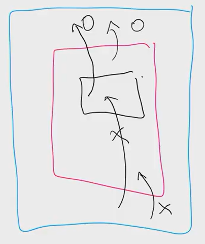

# 7/22 

## 1. 함수(Function)

- E=MC^2 (에러는 more code 의 제곱이다. 사람이 실수하는 것이다.)

- ```python
  def <함수이름>(parameter1, parameter2):
      <코드 블럭>
      return value
  ```

```
def cube(num):
	return num **3
```

```
dir(__builtins__) #dir 안에 있는 것을 보여줌. 내장함수 목록
```

- 함수는 반환하는 값이 있다. 1가지 return만 가능 
- input 은 무한히 가능함 , output은 한개지만

```
def greeting (name='익명',grade):
	   return f'{grade}학년 {name}님, 환영합니다.'
에러남.
왜냐하면 greeting(4)를 했을 때 컴퓨터가 헷갈려하기 때문. 
순서를 바꿔줘야함. 
grade, name='익명'


#greeting(name='홍길동',20) 모호해서 읽지를 못함. 부분만 aregument를 만들고 싶으면 맨뒤에 넣어야함.

다쓰던지 맨뒤에만 적어라. 
```

- parameter 매개변수 

- argument 전달인자

  ```python
  def cube(num): #num 파라매터
  	return num **3
  
  cube(2) #2는 전달인자 
  ```

- ##### 정해지지 않은 여러 개의 인자 처리

  - ```
    print('첫 번째인자','두번째',sep='@',end='!')
    
    >> 첫 번째인자@두번째!
    
    ```

  - **가변 인자 리스트 lists** 

    ```
    def func(a,b, *args):
    	## *args :임의의 개수의 위치인자를 받음을 의미 
    	
    # 가변 인자 예시
    # print문은 *obejcts를 통해 임의의 숫자의 인자를 모두 처리합니다.
    ```

    ```
    def func(*args):
        for i in args:
            if i%2==0:
                print(i)
        
    func(1,2,3,4,5,6) #여러 개의 값을 처리하기 위해 자연스럽게 tuple로 다룸, 순서가 있는 튜플!
                        # *args의 본질은 튜플이다. 
    ```
    
```
    def my_max(*args):
        max_value=args[0]
        for i in args:
            if i>max_value:
                max_value=i
        return max_value
    
    my_max(1,5,1,3,4,9,6,7,2,3,4)
    
    
    or
    
    import sys
    
    def my_max(*args):
        max_value=-sys.maxsize
        for i in args:
            if i>max_value:
                max_value=i
        return max_value
    
    my_max(1,5,1,3,4,9,6,7,2,3,4)
    ```
    
- **가변(임의)키워드 인자**
  
  -정해지지 않은 키워드 인자들은 dict 형태로 처리가 되며 **로 표현
  
  ```
    def func(**kwargs):
    	# **kwargs : 임의의 개수의 키워드 인자를 받음을 의미
    
    
    def my_dict(**kwargs):
        return kwargs
    
    my_dict(한국어='안녕')
        
    # 인자를 지정.
    
    ```

## 2. 함수와 스코프 (scope)

scope- 중2병 히키코모리 막내동생 법칙




- `L`ocal scope: 정의된 함수

- `E`nclosed scope: 상위 함수

- `G`lobal scope: 함수 밖의 변수 혹은 import된 모듈

- `B`uilt-in scope: 파이썬안에 내장되어 있는 함수 또는 속성

  **위에서 아래 순으로 찾는다**(안에서 밖으로)

  so, 내장함수나 외장함수를 쓰지말라고 한 이유는 그 함수를 global 함수로 지정을 해버림. 그 함수만의 역할을 하지 못하게 된다!


## 3. 재귀 함수 

-알고리즘에서만 자주 사용

-재귀함수는 함수 내부에서 자기 자신을 호출 하는 함수를 뜻

-알고리즘을 설계 및 구현에서 유용하게 활용됩니다.


### 팩토리얼 계산 !

- 1부터 n까지 양의 정수를 차례대로 곱한 값이며 !기호로 표기

```
def fact(n):
    result = 1
    for i in range(1,n+1):
        result *= i
    return result
fact(5)
>> 120
```

```
def factorial(n):
    if n==1:
        return 1
    
    return n* factorial(n-1)
# 재귀함수로 표현         
```

```
def sum_error(n):
    if n==0:
        return 0
    return n + sum_error(n-1)

sum_error(10)
>> 55
```


## 플러스 문제

```
def str_count(chars):
    char_dic={}
    for c in chars:
        if c in char_dic: #해당 키가 dict에 있는지
            char_dic[c] +=1
        else:
            char_dic[c]=1
    #char_dic={'a':1,'p':2,'l':1,'e':1}
    res_keys=list(char_dic)# key값만 list로 변환
    
    result=''
    for key in res_keys:
        result += f'{key}는 {char_dic[key]}개'
    
    return result


banana=str_count('banana')
print(banana)

>>b는 1개a는 3개n는 2개
```

