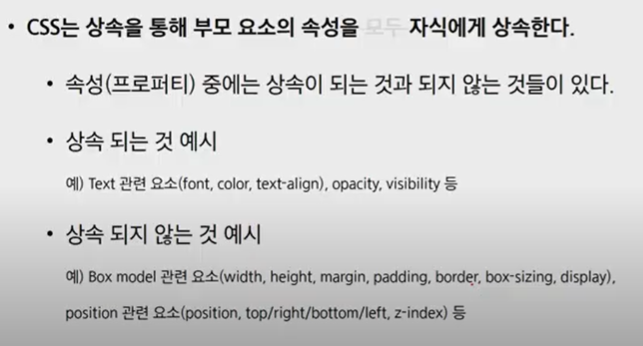
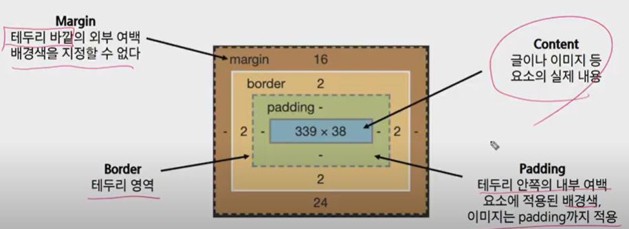
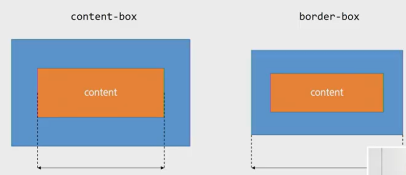

# css

> 스타일이나 레이아웃 등을 통해서 문서를 표시하는 방법을 지정하는 언어
>
> MDN 사이트에서 확인하기 (웹에대한 문서, blog는 신빙성이 없다.)

- css 구문

- css 정의방법 

  - 인라인 (스타일 속성에 정의)

    - 해당 태그 안에 직접 적는다 (관리하기 힘듦. for test)

      `style=color:blue; font-size ~~`

  - 내부 참조 (스타일 사이에 넣음)

    - 하나의 html 에서만 적용

  - 외부 참조 

    - css 파일을 따로 만들어서 head 내 link태그를 통해 불러오기

- 선택자(selector)

  - 특정한 요소를 선택하여서 스타일링을 하기 위해 반드시 필요함.

  - 기초 선택자

    - 타입(요소,태그) 선택자,  id 선택자, 클래스 선택자, 전체 선택

  - 고급선택자

    - 자손선택자: 하위의 모든 요소(띄워쓰기로 구분)

      `article p {color: red;}`

    - 직계 자손 선택자: 바로 아래의 요소 (> 로 구분)

      선택자1> 선택자2 {속성: 속성값} `div>p{color: blue;}` 

    - 형제 요소 선택자: 같은 레벨에 있는 요소 (~로 구분)

      선택자 1 ~ 선택자 2 {속성: 속성값 }`p~section { color : yellow; }`

    - 인접 형제 요소 선택자: 바로 붙어 있는 형제 요소 (+ 로 구분)

      선택자 1 +선택자 2 {속성 : 속성값} `div+p{ color: blue;}`

  - #NM_FAVORITE > div.group_nav > ul.list_nav.NM_FAVORITE_LIST >li:nth-child(1) > a

  - 태그가 위치하는 선택자는 각각 다르다.

    

    **css 적용 우선순위**

  - 중요도 important(사용시 주의- cascading 이기때문에 flow를 끊어버리기때문에 사용할때 정말 중요한 부분아니면 사용하지 않는 것이 좋다.)

  - 인라인 / id 선택자 / class 선택자 /요소 선택자

  - 소스 순서

  

  *css 상속

  

  

- CSS 단위

  - html 의 기본 픽셀은 16px 임
  - em
    - 부모 클래스에 대한 상대적인 단위 (사용할때 주의해야함)
  - rem
    - 전체 16px에 대한 상대적인 단위

- box model 구성

  - content -> padding -> border -> margin 

  

  - 상하좌우
  - .margin-1{ margin :10px 20px } 상하 좌우 
  - .margin-1{ margin :10px 20px 30px}  상 좌우 하 

- box sizing 

  - 기본적으로 모든 요수의 box-sizing은 content-box
  - 다만, 우리가 일반적으로 영역을 볼 때는 border까지의 너비를 100px보는 것을 원함
    - 그 경우 box-sizing을 border-box으로 설정

  

  - 마진 상쇄 

- css display

  - 모든 요소는 네모

  - display: block 
    - 줄 바꿈이 일어나는 요소
    - 화면 크기 전체의 가로 폭을 차지한다.
    - 블록 레벨 요소 안에 인라인 레벨 요소가 들어갈 수 있음
    - div / ul, ol, li / p / hr/ form 
    
  - display: inline
    -  줄 바꿈이 일어나지 않는 행의 일부 요소
    - 컨텐트 너비만큼 가로 폭을 차지한다.
    - width, height, margin-top,bottom을 지정할 수 없다.
    - 상하 여백은 line-height로 지정
    - span/ a / img/ input, label / b, em , i, strong (텍스트 관련) 등
    
  - 속성에 따른 수평 정렬
    - block 은 margin기준 으로 정렬 
    - inline은 text-align  
    
  - display: inline- block
    
    - 컨텐츠 너비 만큼 공간을 차지
    
    - block 과 inline 레벨 요소의 특징을 모두 갖는다
    - inline처럼 한 줄에 표시 가능하며, block 처럼 width, height, margin 속성을 모두 지정할 수 있다.
    
  - display: none

    - 공간을 없애버림.
    - visibility : hidden 은 공간은 차지하나 화면에 표시만 안함.

- css position **실습파알 확인하기**

  - static (기준 위치)
    - 기본적인 요소의 배치 순서에 따름 (좌측 상단)
  - relative
    - 자기 자신의 초반 위치를 기준으로 이동 (상대 위치)
  - absolute
    - static이 아닌 가장 가까이 있는 부모 조상 요소를 기준으로 이동(절대위치)
    - 기본적인 배치 순서에서 제외됨.
  - fixed
    - 부모 요소와 관계없이 브라우저를 기준으로 이동(고정위치)
    - 스크롤시에도 항상 같은 곳에 위치 
  - sticky : relative 처럼 기본 배치 순서는 가지고 있음. 
    - 화면 밖으로 벗어나면 fixed처럼 위치에 고정되어 있음.
    - 부모의 영역이 화면 밖으로 벗어나면 다시 일반적인 흐름을 따름.
    - 