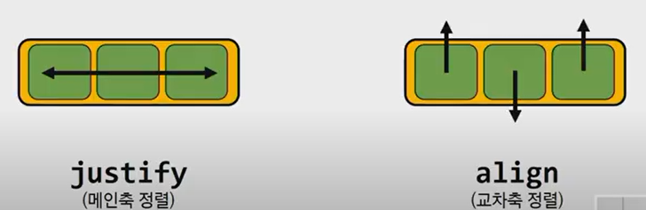
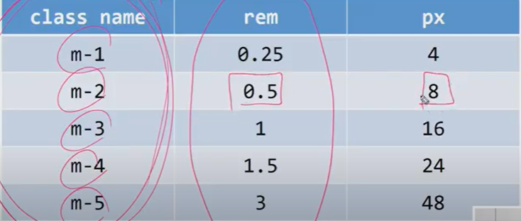
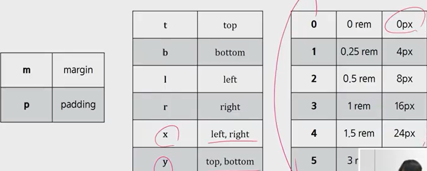

# css layout

> 웹 페이지에 포함되는 요소들을 취합하고 그것들이 어느 위치에 놓일 것인지를 제어하는 기술

- float(집나간 자식)

  - inline, 텍스트 요소들을 감싸주는 역할.

  - 위로 떠버림. 겹쳐질때 float 된 것이 겹쳐진게 아니라 떠버린것임.

  - none : 기본 값
  - left : 요소를 왼쪽으로 띄움
  - right: 요소를 오른쪽으로 뛰움 

- flexbox

  - 요소 간 공간 배분과 정렬 기능을 위한 1차원(단방향)레이아웃

  - **요소와 축 ! **

  - 요소 

    - flex container (부모요소)
    - flex item (자식 요소)

  - 축

    - main axis(메인축)
    - cross axis(교차축)

  - flex에 적용하는 속성

    - content, items(부모요소), self( 자식요소에 적용)

    - 배치 방향 설정 (메인축(main-axis) 방향 변경 - (왼 오 기본값) )
    - 메인축 기준으로 정렬됨.
      - flex-direction
    - 메인축 방향 정렬(우유를 쌓아가는 방향)
      - **justify**-content(여러줄)
    - 교차축 방향 정렬
      - **align**-items(한 줄), align-self(한 개 만), align-content

    

    - inline flex- 자기 너비만큼 플렉스~
    - flex-wrap: wrap; 아래로 떨어진다. 넘어가는 것들.

    

    **자주 쓰이는 것 **

    - justify- content: 메인축 기준 여러 줄 정렬 (부모)

      (warp을 해야지 content 사용 용이)

      만약에 nowrap 이면 두줄도 한줄로 봄 

    - align- items: 교차축 기준 한 줄 정렬 (부모)

    - align-self : 교차축 기준 선택한 요소 하나 정렬 (자식요소에)

      

    - order : 초기값은 0 (list 형태가 아님 같은 클래스의 order 값은 다 같음.)

# Bootstrap

>크로싱 브라우저를 위함 
>
>부트스트랩 공식문서를 띄워놓고 만들자 
>
>class로 조작한다 

- css reboot 하는 방법 

  - reset(공격적)
    - 너네 브라우저 다 없애버릴거야

  - normalize(젠틀한 솔루션)

    - 웹 표준에 근간을 두고 브라우저 스타일을 바꾼다.

    - 부트스트랩 리부트 개발할 때 자주 사용 

- spacing

  

  - .mt-1 (margin top)
  - mx (r, l)
  - mx-auto
  - py-0 : padding 상하를 0

  

- bootstrap grid system
  - flexbox로 구현되어 있음
  - 12개의 column
  - 5개의 grid system
  - 실습자료 참고하기.